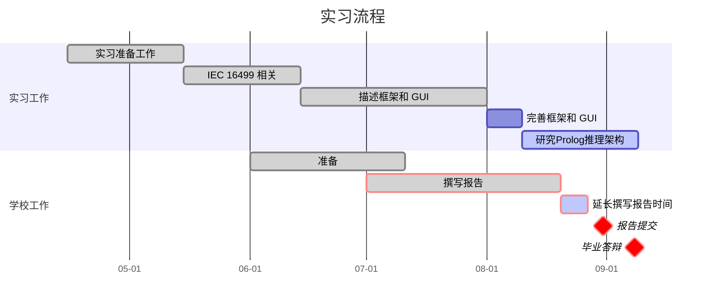

# overview

## 0. Timeline

## 1. Realated work
1. ICE 61499
2. Prolog / Semantic Web / Knownladge Web
3. QT
4. Object Oriential / Refactoring
5. Test Driven Development

## 2. Format
- [x] Pages: about 50 pgs. / `55 Pages`
- Incloude:
  - [x] Title 标题
  - [x] Acknowledgement 致谢
  - [x] Abstract 摘要
  - [x] Introduction: 介绍背景、研究的挑战和提出的问题。简要介绍实习的公司。
  - [x] 报告正文将详细介绍实习的主要阶段、工作安排、使用的方法和工具以及所获成果的详细信息。您将解释所做的选择，并证明所提出的解决方案的合理性。
  - [x] Conclusion: 在结论中列出所取得的成果、这些成果与目标的相关性以及仍需完成的工作。这可以显示项目的原创性以及在工业背景下提出的解决方案。还可以从技术角度、公司知识和人际关系等方面强调项目给学徒带来的个人收获。
  - [x] Annex 附录: 非专业人员没有必要了解的技术细节应包括在附录中。
- 保密问题：如果在起草报告过程中出现任何保密问题，您必须立即联系您的学校导师和/或François Gautier。

## 3. Soutenance
- 时间: 
  - `2023.9.8 10:50 - 11:25` `巴黎时间`
  - `2023.9.8 16:50 - 17:25` `北京时间`
  
- 20 min ppt介绍

- 10 min 问题回答

- 5 min 准备

- Jury number: 

  | <u>BEYLOT Andre-Luc</u> | JAKLLARI Gentian | DUPONT Guillaume |
  | ----------------------- | ---------------- | ---------------- |

  

## 4. Evaluation

### 4.1 Repport

遵守截止日期

> 上传地址：https://moodle-n7.inp-toulouse.fr/course/view.php?id=2328

- [ ] 报告未在考试前一周上传到学校服务器。
- [x] 报告已在考试前一周上传到学校服务器。

书写正确

- [ ] 语言错误影响可读性，或字体难以辨认，或大部分数字难以辨认。
- [ ] 语言错误不影响可读性，字体可读，大部分数字可读。	
- [ ] 无语言错误，字体可读，大部分数字可读。
- [x] 语言特别清晰。字体和所有数字清晰可读。		

报告内容的结构

> 报告规格 ：			
> - [x] 封面
> - [x] 目录
> - [x] 结构（背景、引言、各部分、结论，必要时：附录、参考文献清单、缩略语、注释）
> - [x] 编号（页码、数字、有用的公式）和文中的交叉引用（参考文献、公式、数字）
> - [x] 文本中的交叉引用（参考文献、公式、数字）
> - 如果适用：编写 CSR（企业社会责任）部分		
> - 如果适用：编写 SD 部分（可持续发展）

- [ ] 至少缺少规范中的 3 项标准
- [ ] 缺少规范中的 1 到 2 项标准
- [x] 学生围绕规范构建报告		

介绍实习主题

- [ ] 学生没有介绍实习环境，或没有解释其工作目标
- [ ] 学生介绍了实习环境和工作目标
- [x] 学生介绍了实习环境和工作目标，并将其实习主题与已有内容联系起来。			

处理问题

- [ ] 学生没有介绍方法，或介绍的方法不连贯，或介绍的方法不连贯，或使用的概念不充分，或在使用这些概念时出现重大错误。
- [ ] 学生概述了为实现作业目标而使用的方法。方法具有相关性，但可能包含一些不一致之处，或一些概念使用不当。	
- [x] 学生阐述了实现作业目标的方法。他的方法相关、连贯，概念使用正确。	

提交作业结果

- [ ] 学生没有展示任何结果，或展示的结果、代码、产品不正确或与工作无关。
- [ ] 学生提交的结果（代码、产品）有少数不正确或与其工作无关。
- [x] 学生提交的结果（代码、产品）相关、准确且论证充分。

对其工作成果进行评论

- [ ] 学生没有对自己的成果进行总结，也没有对自己的成果提出任何看法。
- [ ] 学生未对其工作成果进行总结，或未对其工作提出观点、
- [x] 学生总结了自己的工作成果，并对自己的工作提出了看法。
- [ ] 学生对其工作成果进行总结，并提出超出其最初工作范围的观点。

### 4.2 Presentation

在演讲中采取适当的行为
> $^{(1)}$ 不恰当的行为：侮辱性的、在法律上应受到谴责的行为

- [ ] 学生行为不当$^{(1)}$
- [ ] 学生行为得体，但没有努力吸引听众
- [ ] 学生行为得体，并能吸引听众

准备演示材料
> $^{(2)}$ 无法辨认的讲义；字体太小、拼写错误、透明胶片过多
> $^{(3)}$ 非学术性语言：口语化、不专业

- [ ] 材料缺失或难以辨认$^{(2)}$ 或不是用学术语言书写$^{(3)}$
- [ ] 辅助材料清晰可读，使用学术语言书写，但大小不一，或无法跟上流程
- [ ] 材料清晰可读，使用学术语言，可以按照流程操作
- [ ] 辅助材料清晰可读，使用学术语言，通过教育性插图或报告原创的方式，可以让人了解过程。		

演讲内容的结构

> 规范中的标准 : 			
> - 准确性
> - 确定主题			
> - 解释问题
> - 解释其个人做法：有必要使用拼写检查程序			
> - 解释其结果  			
> - 解释其工作结论
> - 尊重时间限制

- [ ] 至少缺少规范中的 3 项标准
- [ ] 缺少 1 到 2 项标准
- [ ] 学生围绕规范撰写演讲稿

 介绍自己的工作成果

>$^{(4)}$不正确：不诚实

- [ ] 学生展示了大部分错误内容$^{(4)}$或与其作品无关的内容。
- [ ] 学生只介绍了少数不正确或与其工作无关的内容。
- [ ] 学生提出的内容相关、准确且论证充分
- [ ] 学生提出相关、准确和论据充分的证据，以支持所提交作品的所有要点。

构建并给出答案

- [ ] 对于大多数问题，学生不知道如何回答，或回答不诚实，或其答案与问题不一致。
- [ ] 偶尔，学生无法回答或回答不诚实或回答与问题不一致
- [ ] 学生回答问题连贯、贴切、清晰
- [ ] 学生以相关的方式回答问题，并提供超出实习范围的补充信息。

具有批判性眼光

- [ ] 学生不做总结，也不提出改进方法。
- [ ] 学生不作总结，也不提出改进工作的设想。
- [ ] 学生对自己的作品进行总结，并提出改进意见。
- [ ] 学生能根据目标评价自己的作品，提出改进方法，并能评估其相关性。		

